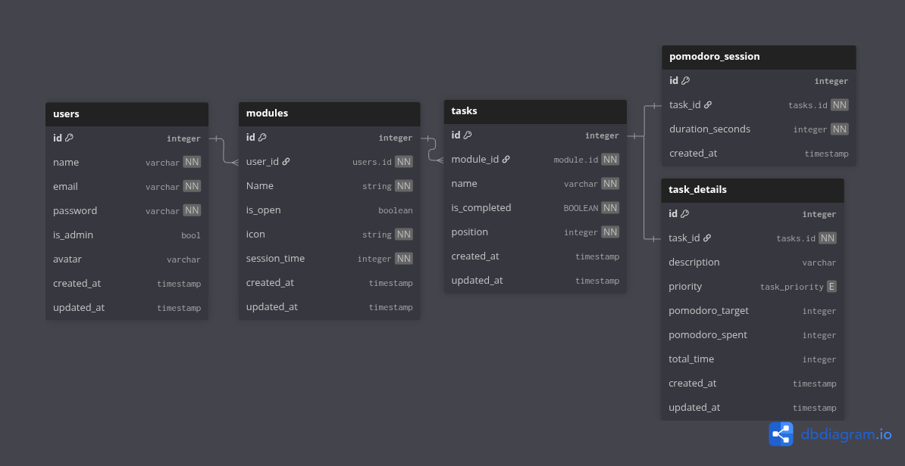

<h1 align="center">
   Doti - API
</h1>

<h3 align="center">
    This is the REST API written in Go to communicate with <a href="https://github.com/Giovani-Coelho/Doti">DOTI</a>.
</h3>

<p>
This project was created to practice Golang. I tried to use native Golang as much as possible without external libraries.
</p>

### Built With
- [Golang](https://go.dev/)
- [Zap](https://github.com/uber-go/zap)
- [Sqlc](https://sqlc.dev/)
- [Migrate](https://github.com/golang-migrate/migrate)
- [godotenv](github.com/joho/godotenv)

### Relationship


## Running

- Execute the container.
- Run the migrations.
- Run the server.

### Docker
Run docker container:
```
docker compose up -d
```

### Migrations
Run Migrations:
```
make migrate-up
```
Revert Migrations:
```
make migrate-down
```
#### Creating a Migration
To create migrations you will need to install _golang-migrate_ globally on your computer
```
go install github.com/golang-migrate/migrate/v4/cmd/migrate@latest
```
And export the path to be able to run the migrate command
```
export PATH=$PATH:$(go env GOPATH)/bin
```
Now, we can use the makefile to create a migration
```
make migration migration_name
```
### Running the application
Execute the server:
```
go run cmd/api/main.go
```

## Referencias

- [Golang Middleware](https://drstearns.github.io/tutorials/gomiddleware/)